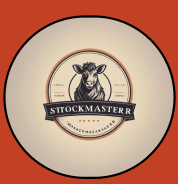

# sttockmasterr

<p align="center">
  
</p>

🚧 **sttockmasterr em construção...** 🚧

---

## Projeto

O projeto **sttockmasterr** é uma aplicação web destinada ao gerenciamento de estoque em lojas. Seu principal objetivo é simplificar o trabalho de gerentes e funcionários, permitindo a visualização e controle eficiente do estoque de produtos. Além disso, o sttockmasterr auxilia na análise dos dados coletados, oferecendo insights valiosos para a tomada de decisões.

## Pré-requisitos

Antes de começar, você vai precisar ter instalado em sua máquina as seguintes ferramentas:

- **Git**: [Git](https://git-scm.com)
- **Node.js**: [Node.js](https://nodejs.org)

O passo a passo da instalação em ambiente Linux e Windows está na documentação delas.

## Instruções de instalação

1. Clone este repositório:

    ```bash
    git clone https://github.com/LuisBFlexa/sttockmasterr.git
    ```

2. Acesse a pasta do projeto no terminal/cmd:

    ```bash
    cd sttockmasterr
    ```

3. Instale as dependências:

    ```bash
    npm install
    ```

4. Rode as migrations e o banco de dados:

    ```bash
    npx prisma migrate dev
    ```

5. Execute a aplicação em modo de desenvolvimento:

    ```bash
    npm run dev
    ```

6. O servidor iniciará na porta:3000 - acesse [http://localhost:3000](http://localhost:3000)

---

## Tecnologias

As seguintes ferramentas foram usadas na construção do projeto:

### Aplicação em geral

- **[Next.js](https://nextjs.org)**: Framework React para desenvolvimento de aplicações web modernas.
- **[NextAuth.js](https://next-auth.js.org)**: Solução completa para autenticação em aplicações Next.js.
- **[Prisma](https://prisma.io)**: ORM para Node.js e TypeScript.
- **[Drizzle](https://orm.drizzle.team)**: ORM moderno para TypeScript.
- **[Tailwind CSS](https://tailwindcss.com)**: Framework CSS utilitário para estilização rápida e responsiva.
- **[tRPC](https://trpc.io)**: Ferramenta para construir APIs fortemente tipadas com TypeScript.

### Backend

- **Next.js API Routes**: Endpoints de API utilizando o próprio Next.js.
- **Prisma**: ORM para interação com o banco de dados.

### Frontend

- **React**: Biblioteca JavaScript para construção de interfaces de usuário.
- **Tailwind CSS**: Framework CSS utilitário para estilização.
- 

### Banco de Dados

- **SQLite**: Sistema de gerenciamento de banco de dados utilizado para desenvolvimento. Pode ser configurado para outros sistemas, como PostgreSQL ou MySQL.

---

## Como contribuir

Contribuições são bem-vindas! Se você tiver sugestões, encontrar bugs ou quiser adicionar novas funcionalidades, sinta-se à vontade para abrir uma issue ou enviar um pull request.

---

## Licença

Copyright (c) 2024 sttockmasterr GRUPO-3

A permissão é concedida, gratuitamente, a qualquer pessoa que obtenha uma cópia deste software e dos arquivos de documentação associados (o "sttockmasterr GRUPO-3"), para lidar no Software sem restrição, incluindo, sem limitação, os direitos de usar, copiar, modificar, mesclar, publicar, distribuir, sublicenciar e/ou vender cópias do Software, e permitir às pessoas a quem o Software é fornecido para fazer isso, sujeito às seguintes condições:

O aviso de copyright acima e esta permissão devem ser incluídos em todas as cópias ou partes substanciais do Software.

O SOFTWARE É FORNECIDO "COMO ESTÁ", SEM GARANTIA DE QUALQUER TIPO, EXPRESSA OU IMPLÍCITA, INCLUINDO, MAS NÃO SE LIMITANDO ÀS GARANTIAS DE COMERCIALIZAÇÃO, ADEQUAÇÃO A UM DETERMINADO FIM E NÃO VIOLAÇÃO. EM NENHUM CASO OS AUTORES OU DETENTORES DOS DIREITOS AUTORAIS SERÃO RESPONSÁVEIS POR QUALQUER REIVINDICAÇÃO, DANOS OU OUTRAS RESPONSABILIDADES, SEJA EM UMA AÇÃO DE CONTRATO, ATO ILÍCITO OU DE OUTRA FORMA, DECORRENTE DE, FORA DE OU EM CONEXÃO COM O SOFTWARE OU O USO OU OUTRAS NEGOCIAÇÕES NO SOFTWARE.

---

